

 

  

此项目为互动社区 `APP` 的 `Android` 原生 `APP`

> 别名（alias）：内容型社交 APP，为我寒假实习/暑期实习/校招（也许还有春招？）H5 方向的项目经历曾经的名称

_前端方向导航_

# 相关项目

1. 项目的 `H5` 页面部分，[CommunityInteractionProject-H5](https://github.com/pandoralink/CommunityInteractionProject-H5)
2. 基于上面那个原生 `Android`，迁移至 `React-Native + expo` 跨端技术栈，[CommunityInteractionProject-expo](https://github.com/pandoralink/CommunityInteractionProject-expo)
2. 原生 `Android` 开发 `APP`，技术栈为 `java`，[content-chat-app](https://github.com/pandoralink/content-chat-app)

# 摘要

为了用户在阅读平台提供文章内容的同时，具有即时分享，互动交互，用户间交互等社交型内容，该项目在 Android 系统上采用相关技术开发了此 APP

# 技术栈

前端：

1. Java：编写 Android 代码
2. Vue：内容提供以及用户创作内容及发布

后端：

1. Spring Boot
2. Express

## 技术架构

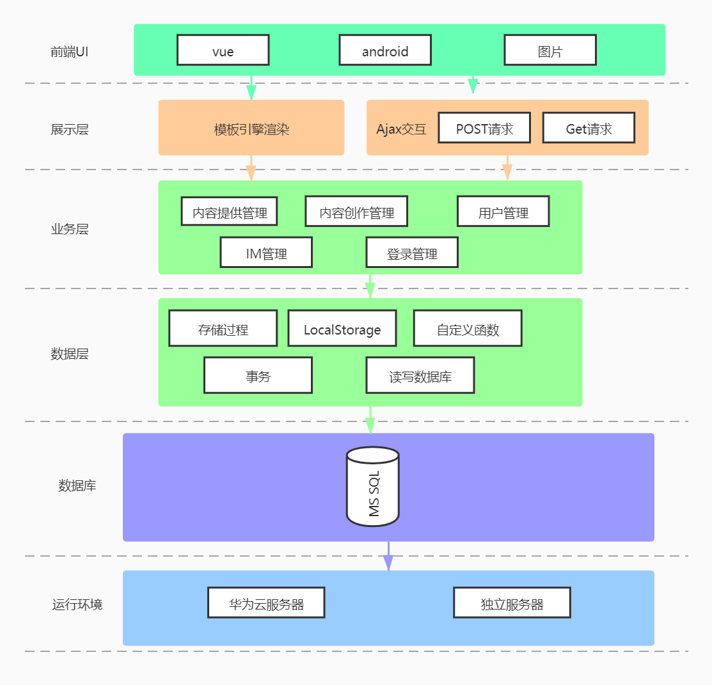

# 功能

## 文章模块

### UI

注：APP 组件库使用的是 Andorid Studio 自带的 Material UI，无任何附加 UI 组件库，大大减少组件库适配的可能和心智成本，简单到起飞！（曾有舍友花费高达一天去适配安装腾讯的组件库 QMUI，而且最后也没有用，白白浪费时间）

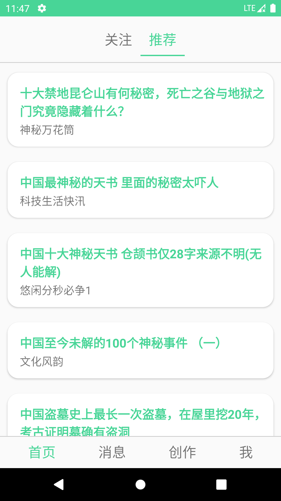
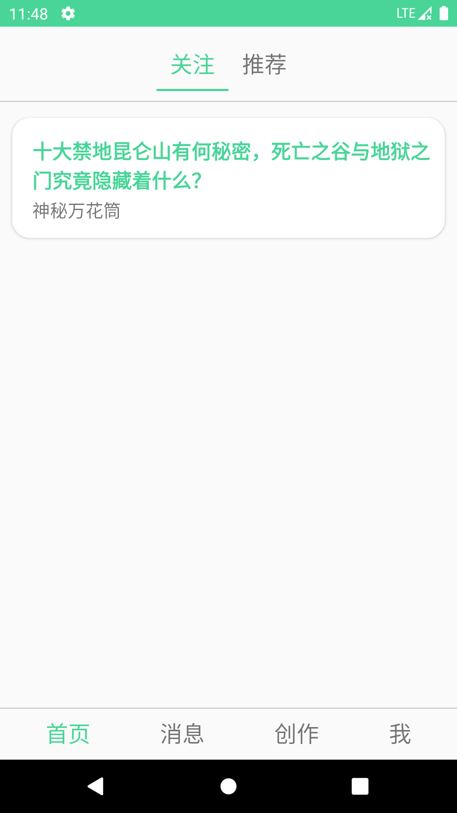
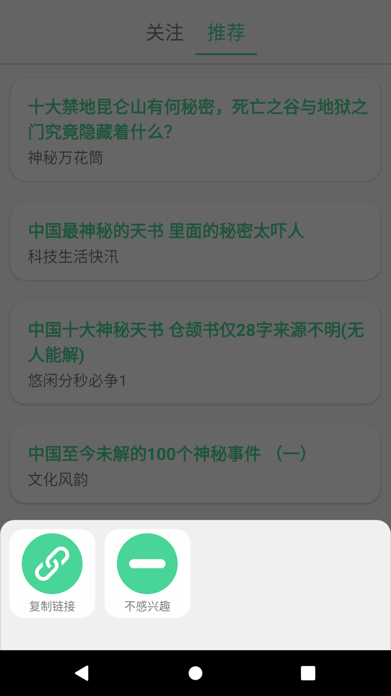
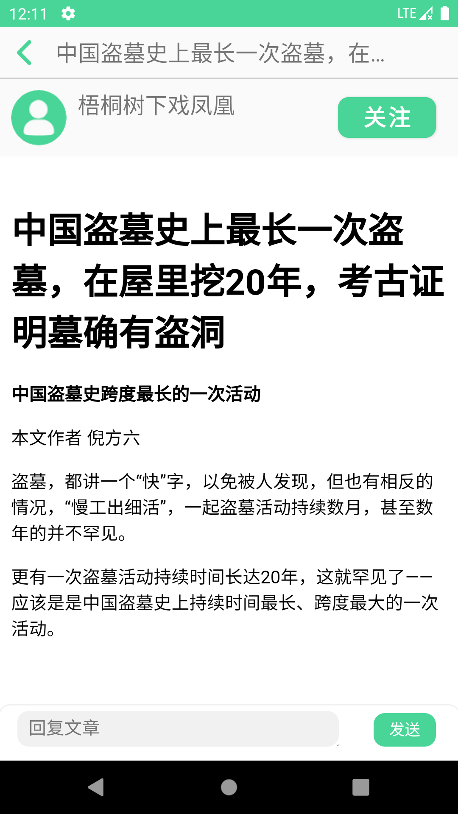
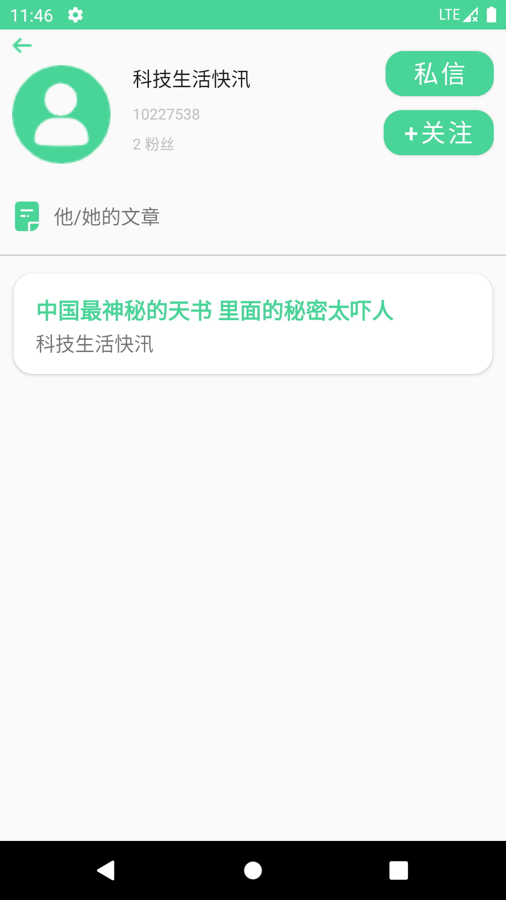
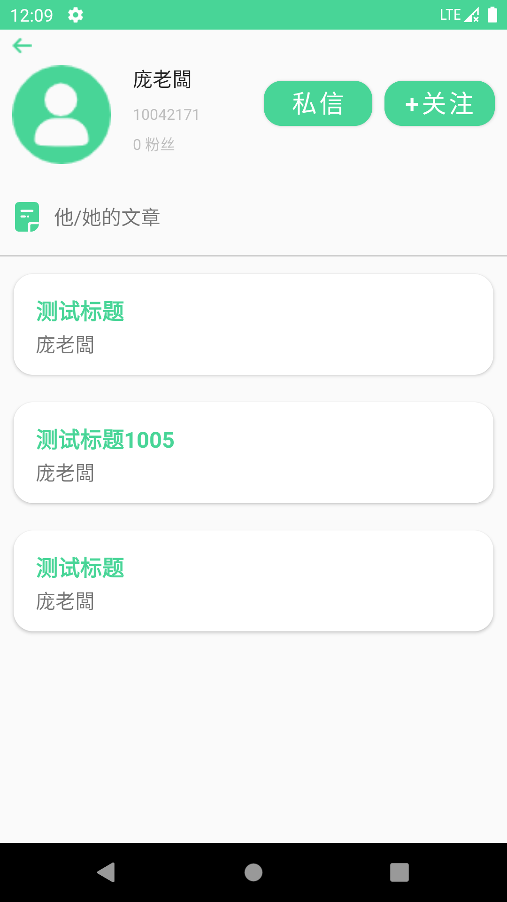

### 布局

_曾被老师单独抽出来鞭挞，特意介绍一下_

主页面布局使用经典的 TabLayout + ViewPager + fragment 管理关注和推荐界面，底层导航栏使用 RadioGroup + ViewPager + fragment 实现，页面的切换依靠 RadioGroup.OnCheckedChangeListener 和 OnPageChangeListener.onPageSelected 两个接口实现，曾因回答不上来而被我的老师怀疑该 APP 是否是我的作品

强烈推荐去阅读一下主页 ViewPager + fragment 的原理及优化（原参考文献我已经找不到了）

### 后端

此部分 API 采用 express 实现，当时作者写这些 API 时贪图 Node.js 快速开发和一把梭的快感，导致恶劣的维护性以及不符合语法规范，暂不开放（包含 webSocket），后续可以查阅存储库是否开发该 APP 后端

**内容说明！**

文章内容全部来源于今日头条，（爬过今日头条的程序员是不是投今日头条的实习也没戏？反正我被拒绝了）

数据结构

1. tree，树：评论
2. stack，栈：webSocket 客户端

也就是你 fork 了这个项目相当于学会什么？

1. Selenium 爬虫
2. 无头浏览器，爬虫要用到的
3. 数据结构树和栈
4. webSocket 全双工通信，再扩展一下不就是等于学会计算机网络？？
5. vue 树形组件展开优化

起飞！！

### 评论及 webSocket

评论文章和评论别人会给作者和别人发送提醒，如果他们在线的话，实现详情如下

评论区的实现由 Vue 去实现，

其中主要涉及到两个组件

回复组件（`<post-comment>`），消息组件（`<message>`）

回复组件（`<post-comment>`）与消息组件解耦，在一些评论区的设计中有人会采用一条评论带一个回复框的选择，不评论时隐藏，评论时渲染，这样设计的好处是可以保证回复数据的正确性，而缺点是更新困难，虽然当前的框架可以帮助我们提高更新 DOM 元素的性能（比如使用 vue 中的指令 v-show or v-if）但是在评论的过程中无法去判定用户会去选择哪一条评论，导致无法对其进行性能优化，因此在评论区的设计中采用了组件分离

这样的设计可以将关注点分离，

回复组件（`<post-comment>`）做回复评论的功能

消息组件（`<message>`）做评论渲染的功能

但这样设计也有一定的缺点，由于消息组件（`<message>`）是一个递归组件（因为评论本身可以有 1 级，2 级…n 级评论，因此需要进行递归设计），比如下图

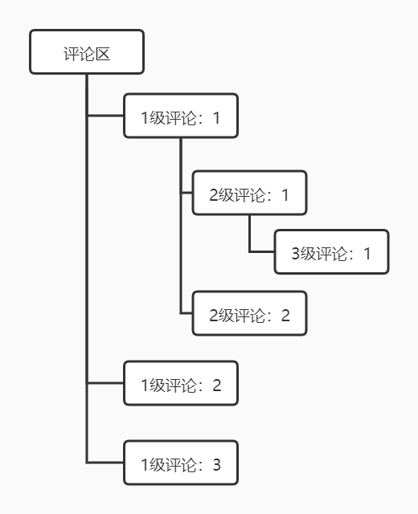

评论区数据结构

像这样的数据结构需要一层层向组件的传递回复/评论的消息（在 Vue 框架中需要如此实现），但实际应用中并不需要太多级的评论，实际上只需要 1-2 级的评论，所以在项目中的设计如下

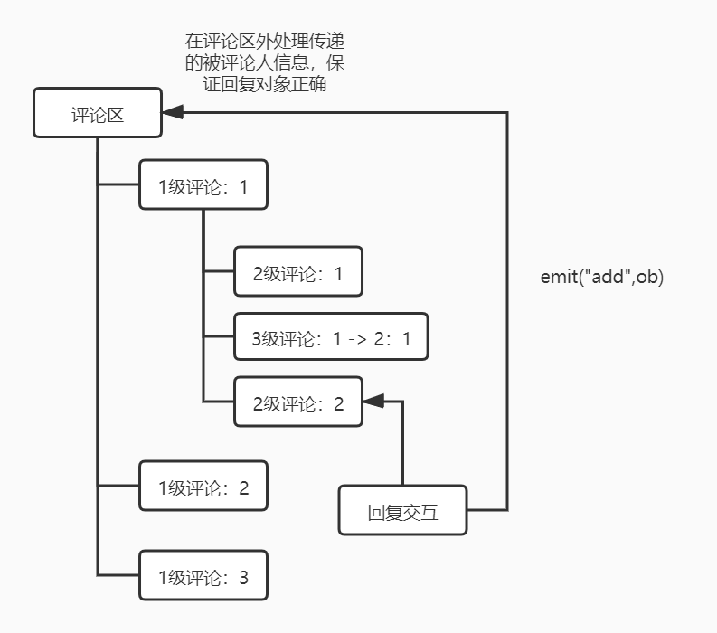

注意：新增评论被回复的场景无法显示回复的评论

比如，对某一文章发表评论后，发现评论有误，想在评论下面加上一条评论补充，此时补充评论无法显示，除非刷新文章。

消息评论具有通知提醒的功能可以通过，通过 vue + websocket 的方式去向相应的客户端发送通知/提醒，每一个客户端启动并且有网的情况会连接服务器的 websocket 建立一个长连接，并通过后端维护的消息队列接收相应的消息/通知/提醒。

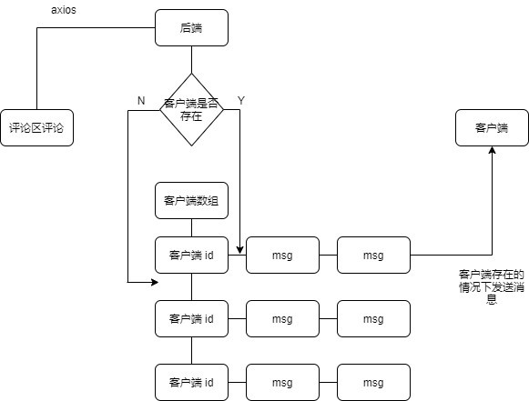

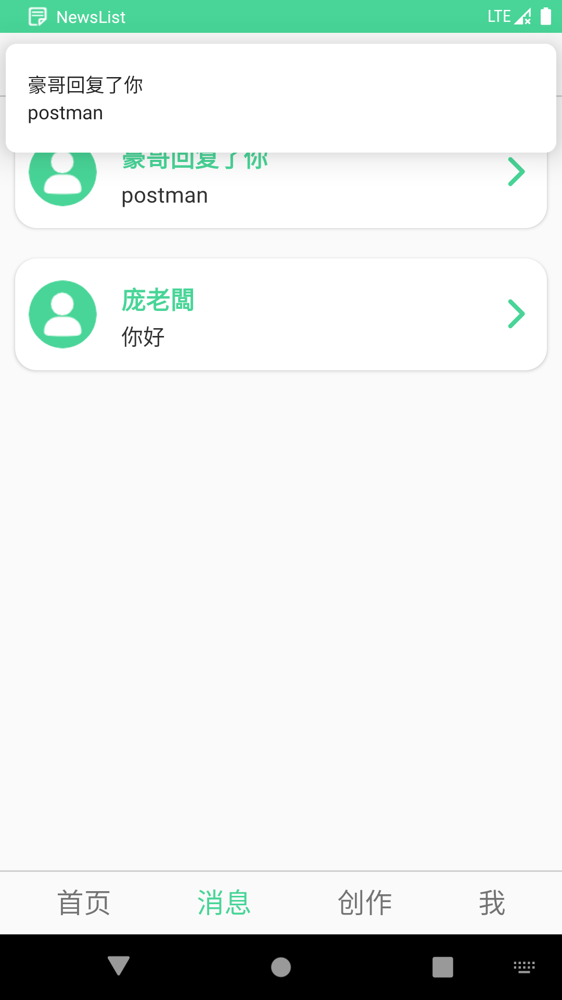
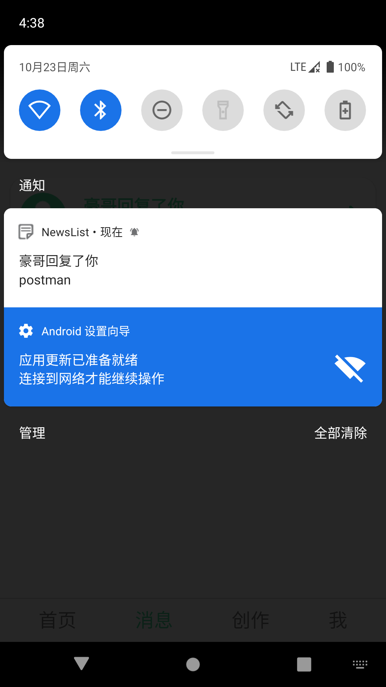

## 创作模块

移动端的创作模块由 webview 实现，使用 wangeditor 实现（wangeditor ： Typescript 开发的 Web 富文本编辑器， 轻量、简洁、易用、开源免费），创作模块的文本编辑器将渲染在 CreateNewFragment。

受限于移动端大小以及性能等各部分原因，移动端只支持部分功能的文本编辑支持，不支持编辑图片、视频等多媒体内容。

创作模块的主要功能实现依赖于 wangeditor + vue（vue 是一个前端框架），功能主要实现于

1. 创作和编写文章
2. 更新和删除文章

流程图为

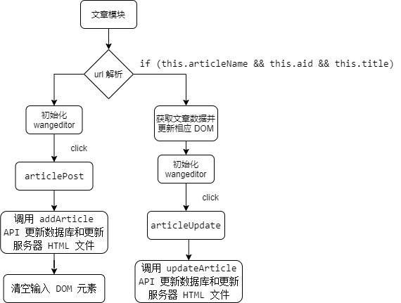
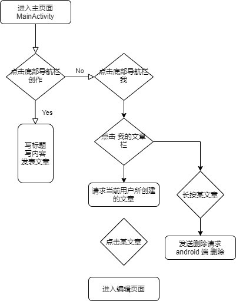

### UI

注：APP 组件库使用的是 Andorid Studio 自带的 Material UI，无任何附加 UI 组件库，大大减少组件库适配的可能和心智成本，简单到起飞！（曾有舍友花费高达一天去适配安装腾讯的组件库 QMUI，而且最后也没有用，白白浪费时间）

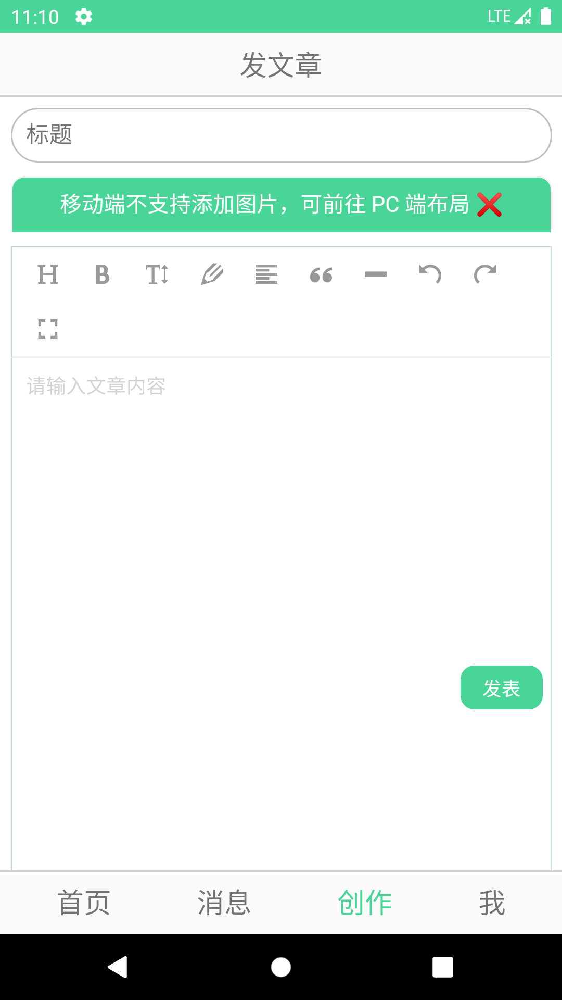
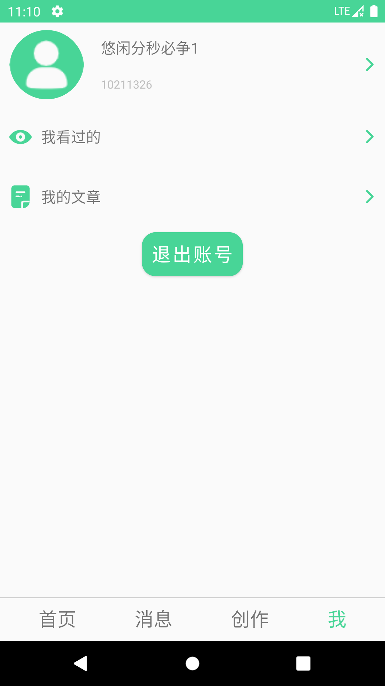
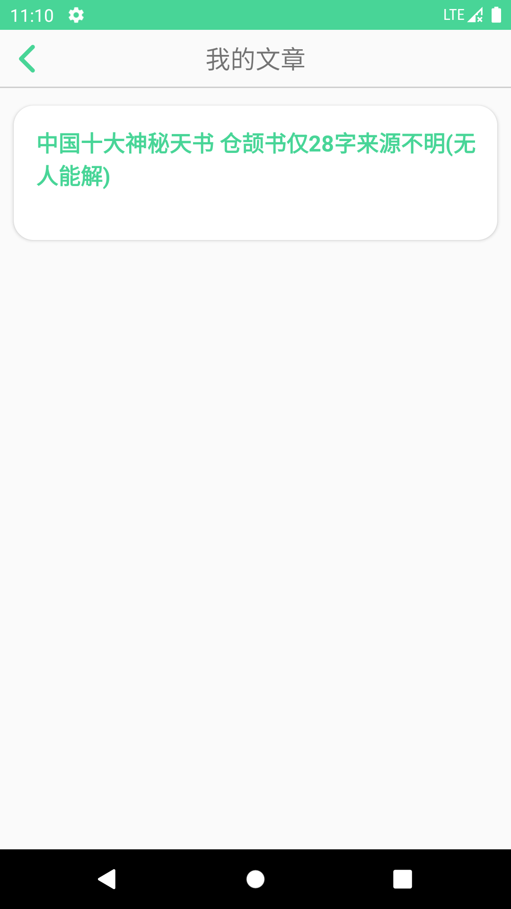
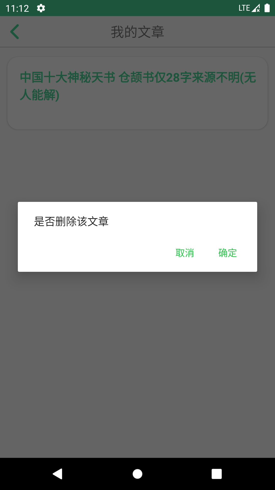

## 登录模块

注：该登录模块过于简陋甚至没有上 Cookie、Session，更不要说 token，所以只用欣赏 UI 部分

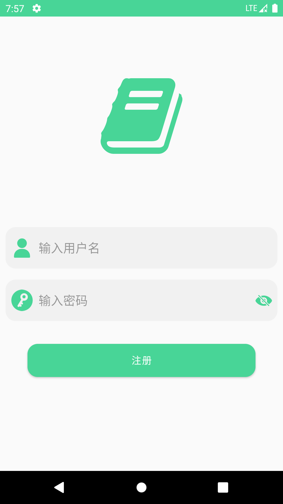

## IM 模块

内容型社交之**社交**实现，该部分 IM 模块的数据库以及后端部分存在严重漏洞，只有在少数情况能够演示成功，没错只在我验收的时候成功了一次！！！牛逼！！，我个人建议使用 webSocket 爆改一下 IM 部分，因为 webSocket 发送提醒和 IM 聊天的底层逻辑都是一样的！而且 webSocket 功能在此项目中非常稳定

同登录模块，太垃圾后端就不上了，看看 UI 就好了（害羞羞）

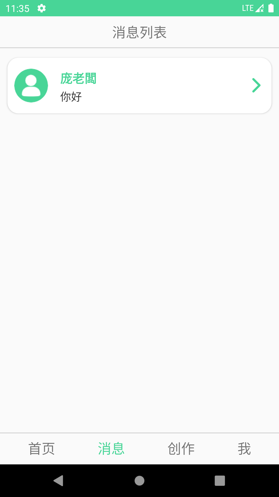
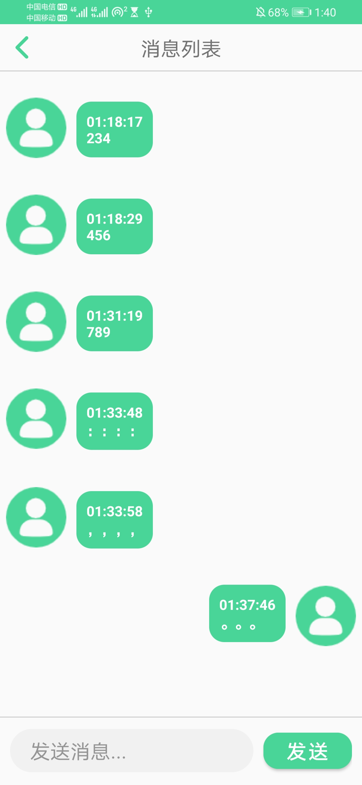

# 总结

作为一个 Android 项目，该 APP 可能在后端部分存在些许纰漏，但我认为在 UI 设计以及交互还有混合开发的考虑都是至少是合格的，完全可以作为一个 Android 上手项目甚至是混合开发上手项目，而且具有非常的可扩展点或者说扩展后可以作为闪光点的部分

扩展点如下

1. 分布式文件存储，HDFS，用于管理用户个人的文章系统
2. 分布式爬虫，该 APP 的数据只有 300 条今日头条文章，我连 IP 都没被封，说明 300 条仍在今日头条的承受范围之内，如果该 APP 能实现更牛逼的爬虫，无论是报告还简历都可以写一下
3. 用户好友系统，这个项目只是实现了评论通知和 IM 即时通讯这种残废的社交，如果实现用户好友系统我觉得才算是一个完整体？其实项目中已经有粉丝系统，用户添加好友的功能其实再写一点点就可以实现